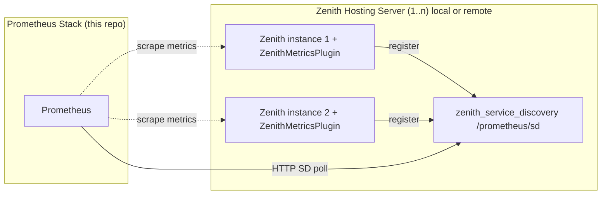

# Prometheus Monitoring Stack

This repository runs a small monitoring stack with Docker Compose:

- Prometheus
- Grafana
- [node-exporter](https://github.com/prometheus/node_exporter)
- Pushgateway (Optional)

It can also talk to Zenith metric endpoints such as:

- [ZenithMetrics](https://github.com/IceTank/ZenithMetrics)
- [zenith_service_discovery](https://github.com/IceTank/PrometheusServiceDiscoveryForZenithGolang)

The `api_scraper` and `zenith_server_discovery` integrations are optional and belong to a different project. This repository only documents how to wire them into Prometheus after those programs already exist.

## Architecture

The diagram below shows how this stack integrates with `zenith_service_discovery` and Zenith game server instances.



**Flow:**

1. Each Zenith instance the `ZenithMetricsPlugin` installed, which registers the instance with a local `zenith_service_discovery` process.
2. Prometheus polls the `/prometheus/sd` endpoint on each configured `zenith_service_discovery` instance (local or remote) using HTTP service discovery. This returns the current list of live Zenith targets.
3. Prometheus scrapes metrics directly from each discovered Zenith instance.

Multiple Zenith servers can register with a single `zenith_service_discovery` instance. Prometheus can be pointed at one local and any number of remote `zenith_service_discovery` instances simultaneously via separate `http_sd_configs` jobs in `prometheus/prometheus.yml`.

## What this stack expects

This Compose setup is designed for a Linux host:

- `node-exporter` mounts `/`, `/proc`, and `/sys` from the host
- Grafana and Prometheus data are persisted in Docker volumes
- All published ports are bound to `127.0.0.1`, so the services are local-only unless you place a reverse proxy in front of them

Published ports:

- Grafana: `127.0.0.1:3000`
- Prometheus: `127.0.0.1:9090`
- Pushgateway: `127.0.0.1:9091`
- node-exporter: `127.0.0.1:9100`

## Prerequisites

Install these on the target system:

- Docker Engine
- Docker Compose v2 (`docker compose`)
- `curl` for reload/health checks

Verify Docker:

```bash
docker --version
docker compose version
```

## Required configuration

### 1. Configure Grafana URL handling

Edit `grafana/grafana.ini`.

The current config assumes Grafana is served behind a reverse proxy under `/grafana/`:

```ini
[server]
root_url = https://<host>/grafana/
serve_from_sub_path = true
```

Replace `<host>` with the real hostname.

Examples:

- If Grafana is exposed as `https://monitoring.example.com/grafana/`, set `root_url = https://monitoring.example.com/grafana/`
- If Grafana is only used locally and not behind a subpath proxy, change it to something like `root_url = http://localhost:3000/` and set `serve_from_sub_path = false`

### 2. Configure Prometheus scrape labels and optional jobs

Edit `prometheus/prometheus.yml`.

At minimum, replace the placeholder instance label in the local node-exporter job:

```yaml
labels:
	service: "host"
	instance: "<host name>"
```

Use a stable hostname such as `hub-01`, `monitoring-host`, or the machine FQDN.

Optional scrape jobs are already included as commented examples for:

- remote `node_exporter` targets
- `api_scraper`
- `zenith_server_discovery`

Optional: `pushgateway` is commented in the Compose, but there is currently no active Prometheus scrape job for it in `prometheus/prometheus.yml`. If you want pushed metrics to appear in Prometheus, add a job such as:

```yaml
- job_name: "pushgateway"
	honor_labels: true
	static_configs:
		- targets: ["pushgateway:9091"]
```
Pushgateway allows you to push custom data to the pushgateway endpoint so that it can be scrapped by prometheus. This is not really needed with the zenith metrics that already get scrapped.

Only enable those jobs after the corresponding service is available. The implementation and deployment of those two optional programs are documented in their own project.

### 3. Review default Grafana credentials

The Compose file currently sets:

```yaml
GF_SECURITY_ADMIN_USER=admin
GF_SECURITY_ADMIN_PASSWORD=admin
```

Before deploying anywhere beyond a local test system, change these values in `docker-compose.yml`.

## Start the stack

From the repository root:

```bash
docker compose up -d
```

Check container state:

```bash
docker compose ps
```

View logs if something fails:

```bash
docker compose logs -f prometheus grafana node-exporter pushgateway
```

## Access the services

Local access:

- Grafana: `http://localhost:3000`
- Prometheus: `http://localhost:9090`
- Pushgateway: `http://localhost:9091`
- node-exporter metrics: `http://localhost:9100/metrics`

If you keep the current loopback-only port bindings, remote access requires a reverse proxy or SSH tunnel.

## Reverse proxy setup

The repository does not include a reverse proxy, but the Grafana config assumes one if you use `/grafana/`.

Typical reverse proxy responsibilities:

- terminate TLS
- route `/grafana/` to `http://127.0.0.1:3000/`
- optionally route Prometheus to `http://127.0.0.1:9090/`
- preserve the `/grafana/` subpath if `serve_from_sub_path = true`

If you do not want subpath routing, simplify `grafana/grafana.ini` and expose Grafana directly.

## Firewall and Docker networking

Docker containers cannot reach host services that are blocked by the firewall or only listening on an unreachable interface.

If a scrape target runs on the Docker host and Prometheus cannot reach it, allow traffic from Docker's bridge network.

For `ufw`-based systems:

```bash
sudo ufw allow in on docker0
sudo ufw reload
sudo ufw status verbose
```

If needed, explicitly allow the Docker subnet:

```bash
docker network inspect monitoring -f '{{range .IPAM.Config}}{{.Subnet}}{{end}}'
```

```bash
SUBNET=<from command above>
sudo ufw allow proto tcp from "$SUBNET" to any
sudo ufw reload
sudo ufw status verbose
```

This matters especially when you enable scrape jobs that use:

- `host.docker.internal:<port>`
- another machine on the LAN
- a service discovery endpoint exposed on the host

## Reload Prometheus after config changes

Prometheus is started with `--web.enable-lifecycle`, so config reloads can be done without recreating the container:

```bash
curl -X POST http://localhost:9090/-/reload
```

If the reload fails, inspect the logs:

```bash
docker compose logs prometheus
```

## Data persistence

Docker volumes used by this stack:

- `prometheus-data`
- `grafana-data`

To stop the stack without deleting data:

```bash
docker compose down
```

To remove containers and volumes:

```bash
docker compose down -v
```

## Optional integrations

### api_scraper

The Compose file contains a commented example service and Prometheus scrape job for `api_scraper`.

Use it only after:

- the image is built or otherwise available locally
- the exporter is reachable on the configured port
- the external project documentation has been followed

### zenith_server_discovery

The Prometheus config contains commented `http_sd_configs` examples for a `zenith_server_discovery` endpoint.

Use them only after:

- the discovery service is already deployed
- the `/prometheus/sd` endpoint is reachable from the Prometheus container
- the external project documentation has been followed

## Initial validation checklist

After startup, verify:

- Grafana opens and the Prometheus datasource is healthy
- Prometheus shows `prometheus` and `node_exporter` as `UP`
- `http://localhost:9100/metrics` returns node-exporter metrics
- any optional target you enabled is reachable from Prometheus
